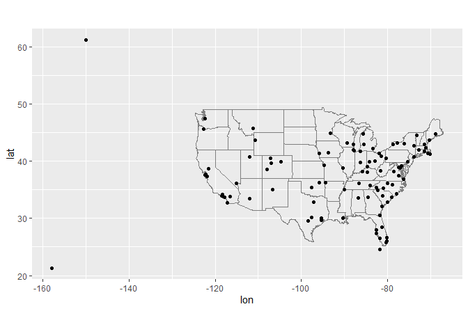
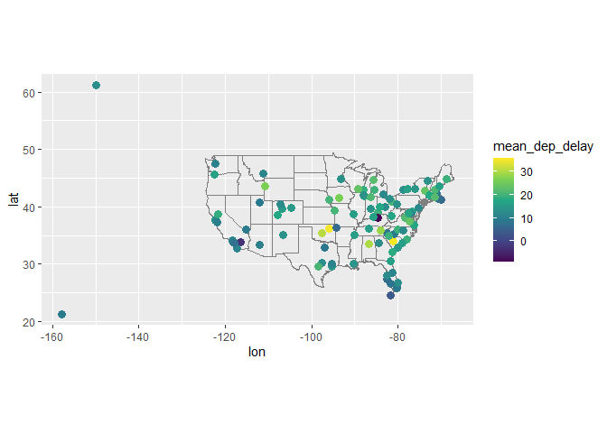
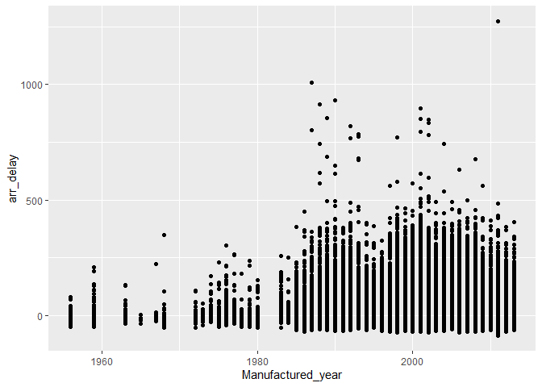
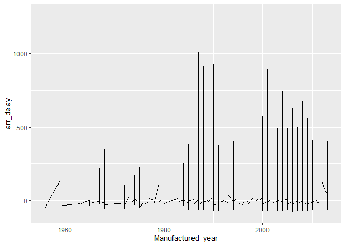
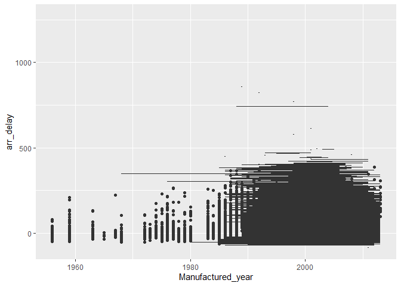

Lesson12
================

``` r
library(tidyverse)
```

    ## ── Attaching core tidyverse packages ──────────────────────── tidyverse 2.0.0 ──
    ## ✔ dplyr     1.2.1     ✔ readr     2.2.0
    ## ✔ forcats   1.0.1     ✔ stringr   1.6.0
    ## ✔ ggplot2   4.0.3     ✔ tibble    3.3.1
    ## ✔ lubridate 1.9.5     ✔ tidyr     1.3.2
    ## ✔ purrr     1.2.2     
    ## ── Conflicts ────────────────────────────────────────── tidyverse_conflicts() ──
    ## ✖ dplyr::filter() masks stats::filter()
    ## ✖ dplyr::lag()    masks stats::lag()
    ## ℹ Use the conflicted package (<http://conflicted.r-lib.org/>) to force all conflicts to become errors

``` r
library(nycflights13) # install.packages("nycflights13")
library(dplyr)
library(ggplot2)
```

# Understanding nycflights13:

- nycflights13 contains four tibbles that are related to the flights
  table:

- airlines

- airports

- planes

- weather +For nycflights13:

- flights connects to planes via a single variable, tailnum.

- flights connects to airlines through the carrier variable.

- flights connects to airports in two ways: via the origin and dest
  variables.

- flights connects to weather via origin (the location), and year,
  month, day and hour (the time).

# 13.2.1 Exercises

### 1) Imagine you wanted to draw (approximately) the route each plane flies from its origin to its destination. What variables would you need? What tables would you need to combine?

- You would need the lat and long from the airports table along with the
  origin and destination from the flights table. Combining the airport
  and flights tables would help, but faa needs to be mutated to origin.

``` r
flights_ex1 <- flights %>% 
  select(flight, origin, dest) %>% 
  inner_join(airports, c("origin" = "faa"))
```

### 2) I forgot to draw the relationship between weather and airports. What is the relationship and how should it appear in the diagram?

- Airports has an faa column which is synonymous with the origin column
  in the weather table. That is how they are connected. To demonstrate
  their relationship in the diagram, there should be a long arrow
  connecting airports’ faa with weather’s origin.

### 3) weather only contains information for the origin (NYC) airports. If it contained weather records for all airports in the USA, what additional relation would it define with flights?

- It would provide the destination weather conditions, as well, for each
  flight/location.

### 4) We know that some days of the year are “special”, and fewer people than usual fly on them. How might you represent that data as a data frame? What would be the primary keys of that table? How would it connect to the existing tables?

- The data would need to be represented with columns indicating the
  flight number, date, time, number of passengers, and percent capacity.
  The primary keys of that table would be year, month, day, time, and
  flight number to create a unique identity.

# Notes on keys:

# There are two types of keys:

- A primary key uniquely identifies an observation in its own table. For
  example, planes\$tailnum is a primary key because it uniquely
  identifies each plane in the planes table.

- A foreign key uniquely identifies an observation in another table. For
  example, flights\$tailnum is a foreign key because it appears in the
  flights table where it matches each flight to a unique plane.

- A variable can be both a primary key and a foreign key. For example,
  origin is part of the weather primary key, and is also a foreign key
  for the airports table.

- Once you’ve identified the primary keys in your tables, it’s good
  practice to verify that they do indeed uniquely identify each
  observation. One way to do that is to count() the primary keys and
  look for entries where n is greater than one:

``` r
planes %>% 
  count(tailnum) %>% 
  filter(n > 1)
```

    ## # A tibble: 0 × 2
    ## # ℹ 2 variables: tailnum <chr>, n <int>

``` r
#> # ℹ 2 variables: tailnum <chr>, n <int>
```

``` r
weather %>% 
  count(year, month, day, hour, origin) %>% 
  filter(n > 1)
```

    ## # A tibble: 3 × 6
    ##    year month   day  hour origin     n
    ##   <int> <int> <int> <int> <chr>  <int>
    ## 1  2013    11     3     1 EWR        2
    ## 2  2013    11     3     1 JFK        2
    ## 3  2013    11     3     1 LGA        2

``` r
#> # A tibble: 3 × 6
#>    year month   day  hour origin     n
#>   <int> <int> <int> <int> <chr>  <int>
#> 1  2013    11     3     1 EWR        2
#> 2  2013    11     3     1 JFK        2
#> 3  2013    11     3     1 LGA        2
```

# Practice binding rows from multiple lotr datasets:

``` r
fship <- read_csv("https://raw.githubusercontent.com/jennybc/lotr-tidy/master/data/The_Fellowship_Of_The_Ring.csv")
```

    ## Rows: 3 Columns: 4
    ## ── Column specification ────────────────────────────────────────────────────────
    ## Delimiter: ","
    ## chr (2): Film, Race
    ## dbl (2): Female, Male
    ## 
    ## ℹ Use `spec()` to retrieve the full column specification for this data.
    ## ℹ Specify the column types or set `show_col_types = FALSE` to quiet this message.

``` r
ttow <- read_csv("https://raw.githubusercontent.com/jennybc/lotr-tidy/master/data/The_Two_Towers.csv")
```

    ## Rows: 3 Columns: 4
    ## ── Column specification ────────────────────────────────────────────────────────
    ## Delimiter: ","
    ## chr (2): Film, Race
    ## dbl (2): Female, Male
    ## 
    ## ℹ Use `spec()` to retrieve the full column specification for this data.
    ## ℹ Specify the column types or set `show_col_types = FALSE` to quiet this message.

``` r
rking <- read_csv("https://raw.githubusercontent.com/jennybc/lotr-tidy/master/data/The_Return_Of_The_King.csv")
```

    ## Rows: 3 Columns: 4
    ## ── Column specification ────────────────────────────────────────────────────────
    ## Delimiter: ","
    ## chr (2): Film, Race
    ## dbl (2): Female, Male
    ## 
    ## ℹ Use `spec()` to retrieve the full column specification for this data.
    ## ℹ Specify the column types or set `show_col_types = FALSE` to quiet this message.

``` r
# And try binding these separate dataframes together: two ways to do it

#1
lotr_untidy <- dplyr::bind_rows(fship, ttow, rking)
# View the 9 generated rows
head(lotr_untidy, 9)
```

    ## # A tibble: 9 × 4
    ##   Film                       Race   Female  Male
    ##   <chr>                      <chr>   <dbl> <dbl>
    ## 1 The Fellowship Of The Ring Elf      1229   971
    ## 2 The Fellowship Of The Ring Hobbit     14  3644
    ## 3 The Fellowship Of The Ring Man         0  1995
    ## 4 The Two Towers             Elf       331   513
    ## 5 The Two Towers             Hobbit      0  2463
    ## 6 The Two Towers             Man       401  3589
    ## 7 The Return Of The King     Elf       183   510
    ## 8 The Return Of The King     Hobbit      2  2673
    ## 9 The Return Of The King     Man       268  2459

``` r
#2
lotr_untidy <- base::rbind(fship, ttow, rking)
head(lotr_untidy, 9)
```

    ## # A tibble: 9 × 4
    ##   Film                       Race   Female  Male
    ##   <chr>                      <chr>   <dbl> <dbl>
    ## 1 The Fellowship Of The Ring Elf      1229   971
    ## 2 The Fellowship Of The Ring Hobbit     14  3644
    ## 3 The Fellowship Of The Ring Man         0  1995
    ## 4 The Two Towers             Elf       331   513
    ## 5 The Two Towers             Hobbit      0  2463
    ## 6 The Two Towers             Man       401  3589
    ## 7 The Return Of The King     Elf       183   510
    ## 8 The Return Of The King     Hobbit      2  2673
    ## 9 The Return Of The King     Man       268  2459

``` r
View(airports)
```

# Join functions

### To practice the join functions, we’ll subset the flights dataframe as follows

``` r
flights2 <- flights %>% 
  select(year:day, hour, origin, dest, tailnum, carrier)
flights2
```

    ## # A tibble: 336,776 × 8
    ##     year month   day  hour origin dest  tailnum carrier
    ##    <int> <int> <int> <dbl> <chr>  <chr> <chr>   <chr>  
    ##  1  2013     1     1     5 EWR    IAH   N14228  UA     
    ##  2  2013     1     1     5 LGA    IAH   N24211  UA     
    ##  3  2013     1     1     5 JFK    MIA   N619AA  AA     
    ##  4  2013     1     1     5 JFK    BQN   N804JB  B6     
    ##  5  2013     1     1     6 LGA    ATL   N668DN  DL     
    ##  6  2013     1     1     5 EWR    ORD   N39463  UA     
    ##  7  2013     1     1     6 EWR    FLL   N516JB  B6     
    ##  8  2013     1     1     6 LGA    IAD   N829AS  EV     
    ##  9  2013     1     1     6 JFK    MCO   N593JB  B6     
    ## 10  2013     1     1     6 LGA    ORD   N3ALAA  AA     
    ## # ℹ 336,766 more rows

``` r
View(flights)
View(airlines)
flights <- flights

avg_delay_dest <- flights %>% select(dep_delay, arr_delay, dest) %>% full_join(dep_delay, arr_delay, by = "dest")
```

### 1. Compute the average delay by destination, then join on the airports data frame so you can show the spatial distribution of delays. Here’s an easy way to draw a map of the United States:

``` r
library(maps) #install.packages("maps")
```

    ## Warning: package 'maps' was built under R version 4.6.1

    ## 
    ## Attaching package: 'maps'

    ## The following object is masked from 'package:purrr':
    ## 
    ##     map

``` r
airports %>%
  semi_join(flights, c("faa" = "dest")) %>%
  ggplot(aes(lon, lat)) +
  borders("state") +
  geom_point() +
  coord_quickmap()
```

    ## Warning: `borders()` was deprecated in ggplot2 4.0.0.
    ## ℹ Please use `annotation_borders()` instead.
    ## This warning is displayed once per session.
    ## Call `lifecycle::last_lifecycle_warnings()` to see where this warning was
    ## generated.

<!-- -->

``` r
View(planes)
```

``` r
# first subset the dataframe for easier use and call the object flight_delays
# sum the arrival and departure delays, create a new column for those with mutate. Then take the avg/mean of total delay by destination.

#flight_delays <- flights %>% 
  #select(dep_delay, arr_delay, dest, origin) 


 # mutate(total_delay = dep_delay + arr_delay) %>% 
  #group_by(dest) %>% 
  #summarize(total_delay, .by = )

#mean(flight_delays$total_delay, na.rm = TRUE)
```

# try again

``` r
# each depature and arrival delay represents a different location, so their means have to be calculated separately 

flight_delays <- flights %>% 
  select(dep_delay, arr_delay, dest, origin, tailnum) %>% 
  mutate(total_delay = dep_delay + arr_delay)


mean_flight_delays <- flight_delays %>% group_by(dest) %>% 
  summarise(mean_arr_delay = mean(arr_delay, na.rm = TRUE), mean_dep_delay = mean(dep_delay, na.rm = TRUE)) 

mean_flight_delays %>% inner_join(airports, c("dest" = "faa")) %>% 
  ggplot(aes(lon, lat)) +
  borders("state") +
  geom_point(aes(color = mean_dep_delay), size = 3) +
  scale_color_viridis_c(option = "C + B") +
  coord_quickmap()
```

    ## Warning in viridisLite::viridis(n, alpha, begin, end, direction, option):
    ## Option 'C + B' does not exist. Defaulting to 'viridis'.

<!-- -->

yoooo idk how to make this work

``` r
library(usmap)
# map <- plot_usmap()

flight_delays <- flights %>% 
  select(dep_delay, arr_delay, dest, origin, tailnum) %>% 
  mutate(total_delay = dep_delay + arr_delay)

#mean_flight_delays %>% inner_join(airports, c("dest" = "faa")) %>% 
 # ggplot(aes(lon, lat)) +
 # borders("state") +
 # geom_point(aes(color = mean_dep_delay), size = 3) +
 # scale_color_viridis_c(option = "C")
```

``` r
# my attempt
#mean_flight_delays %>% inner_join(airports, c("dest" = "faa")) %>% 
 # plot_usmap(regions = "states", data = mean_flight_delays, values = "dest") %>% 
 #  ggplot(aes(lon, lat)) +
 # borders("state") +
 # geom_point(aes(color = mean_dep_delay), size = 3) +
 # scale_color_viridis_c(option = "C")
```

this code doesn’t really work oh well

``` r
# 1. Join your data and filter out airports outside the US map boundaries
map_data <- mean_flight_delays %>% 
  inner_join(airports, by = c("dest" = "faa")) %>% 
  filter(!is.na(lon) & !is.na(lat))

# 2. Transform the raw longitude/latitude points into the usmap projection
transformed_data <- usmap_transform(map_data, input_cols = c("lon", "lat"))

# 3. Build the plot using the transformed coordinates
plot_usmap(regions = "states", color = "gray80", fill = "white") +
  geom_point(data = map_data, 
             aes(x = lon, y = lat, color = mean_dep_delay), 
             size = 3) +
  scale_color_viridis_c(option = "plasma") + # 'plasma' corresponds to option C
  labs(color = "Mean Dep Delay")
```

Example 2:

# Add the location of the origin and destination (i.e. the lat and lon) to flights.

``` r
locations <- airports %>% select(lon, lat, faa)

flight_org_dest <- flights %>% select(origin, dest, flight, year, month, day, dep_time)

# dont even need to do above step, could just create flight_org from flights itself

flight_org <- flight_org_dest %>% select(origin, flight, year, month, day, dep_time)

flight_dest <- flight_org_dest %>% select(dest, flight, year, month, day, dep_time)

flight_org_loc <- flight_org %>% inner_join(locations, c("origin" = "faa")) %>%          
  rename(org_lon = lon, org_lat = lat)

flight_dest_loc <- flight_dest %>% inner_join(locations, c("dest" = "faa")) %>%          
  rename(dest_lon = lon, dest_lat = lat)

flight_locations <- flight_org_loc %>% full_join(flight_dest_loc, 
                                                 by = join_by(flight, year, month, day, dep_time),
                                                 relationship = "many-to-many")


# there could be a much simpler way of doing this, potentially using full_join and
# left_join without making a ton of new objects. IDK we are learning here.
```

# THE LAST EXAMPLE PROBLEM:

### Is there a relationship between the age of a plane and its delays?

``` r
View(planes)

library(ggplot2)

flight_delays <- flights %>% 
  select(dep_delay, arr_delay, dest, origin, tailnum) %>% 
  mutate(total_delay = dep_delay + arr_delay)

flight_delays[c("dep_delay", "arr_delay")][is.na(flight_delays[c("dep_delay", "arr_delay")])] <- 0

clean_planes <- planes %>% select(tailnum, year) %>% rename(Manufactured_year = year) %>% 
  arrange(Manufactured_year, decreasing = FALSE) %>% na.omit

rel_plane_delay <- flight_delays %>% inner_join(clean_planes, by = "tailnum") %>% 
  arrange(Manufactured_year, decreasing = FALSE)

# seems to work but I'd love to make better visuals to display the relationship between age of plane and delay. ggplot is not my friend today.
ggplot(rel_plane_delay) +
  geom_point(aes(x = Manufactured_year, y = total_delay))
```

    ## Warning: Removed 5011 rows containing missing values or values outside the scale range
    ## (`geom_point()`).

<!-- -->

``` r
# IDK how to add geom_smooth() to make it right, this is so hard

# weird lines ahh what is this even
ggplot(rel_plane_delay) +
  geom_line(aes(x = Manufactured_year, y = total_delay))
```

<!-- -->

``` r
## ahh scary this is awful
ggplot(rel_plane_delay) +
  geom_boxplot(mapping = aes(x = Manufactured_year, y = total_delay, group=total_delay ))
```

    ## Warning: Removed 5011 rows containing missing values or values outside the scale range
    ## (`stat_boxplot()`).

<!-- -->
